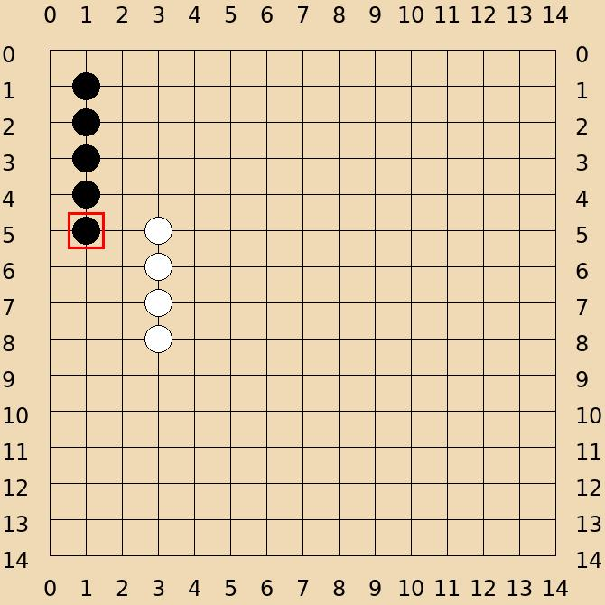

# 五子棋游戏使用说明

## 基本指令
1. `/gomoku_pvp` - 创建一局 PVP 对战游戏
2. `/gomoku join` - 加入当前游戏
3. `/gomoku end` - 结束当前游戏（仅游戏参与者可执行）
4. `/gomoku surrender` - 投降认输（仅游戏参与者可执行）
5. `/gomoku (x,y)` - 在指定坐标落子，如 `/gomoku (7,7)`
6. `/gomoku undo` - 请求悔棋（需对手同意）
7. `/gomoku accept` - 同意对手的悔棋请求
8. `/gomoku reject` - 拒绝对手的悔棋请求

## 游戏规则
1. 棋盘大小为 15×15
2. 黑子先手，白子后手
3. 五子连线（横、竖、斜）即可获胜
4. 棋盘落满未分出胜负则为和局

## 游戏流程
1. 使用 `/gomoku_pvp` 开始一局新游戏
2. 两名玩家分别使用 `/gomoku join` 加入游戏
   - 第一位加入的玩家使用黑子
   - 第二位加入的玩家使用白子
3. 玩家轮流使用 `/gomoku (x,y)` 格式在棋盘上落子
   - 坐标范围为 0-14
   - 横坐标(x)和纵坐标(y)都必须在范围内
   - 不能在已有棋子的位置落子

## 游戏结束条件
游戏在以下情况下结束：
1. 一方五子连线获胜
2. 棋盘落满未分出胜负则为和局
3. 一方投降认输
4. 游戏参与者主动结束游戏

## 悔棋规则
1. 只有在**对方回合**时才能请求悔棋
2. 悔棋需要对方同意，对方可以选择同意或拒绝
3. 如果对方同意悔棋，将回退到上一步（移除你的最后一步棋）
4. 悔棋后轮到请求方落子
5. 每次只能悔一步棋

## 注意事项
1. 只有当前回合的玩家才能落子
2. 只有游戏参与者可以结束游戏或投降
3. 每个群聊/私聊只能同时进行一局游戏
4. 如果玩家没有名字，系统会自动分配"玩家1"、"玩家2"作为默认名称

## 坐标系统说明
- 棋盘四周有数字坐标标记（0-14）
- 落子时使用 `(x,y)` 格式，例如：
  - `(0,0)` 表示左上角
  - `(7,7)` 表示棋盘中心
  - `(14,14)` 表示右下角

## 示例操作
```
玩家A: /gomoku_pvp
系统: PVP 模式开启，请输入 /gomoku join 加入游戏！

玩家A: /gomoku join
系统: 玩家A 加入对局！等待另一位玩家加入。

玩家B: /gomoku join
系统: 玩家B 加入对局！游戏开始，玩家A（黑子）先落子。

玩家A: /gomoku (7,7)
系统: 轮到 玩家B（白子）下棋！

玩家B: /gomoku (8,8)
系统: 轮到 玩家A（黑子）下棋！

玩家A: /gomoku (7,8)
系统: 轮到 玩家B（白子）下棋！

玩家B: /gomoku undo
系统: 玩家B 请求悔棋，玩家A 请输入 /gomoku accept 同意，或 /gomoku reject 拒绝。

玩家A: /gomoku accept
系统: 玩家A 同意了 玩家B 的悔棋请求！轮到 玩家B 落子。
```

